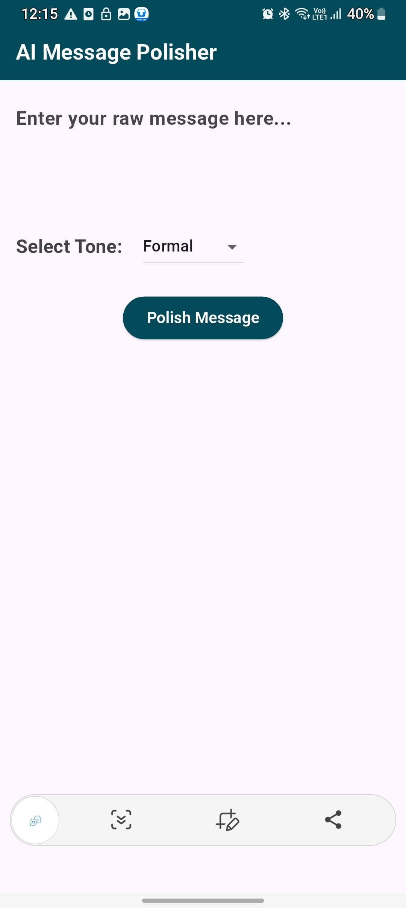
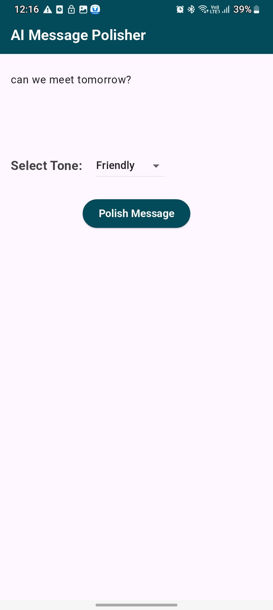
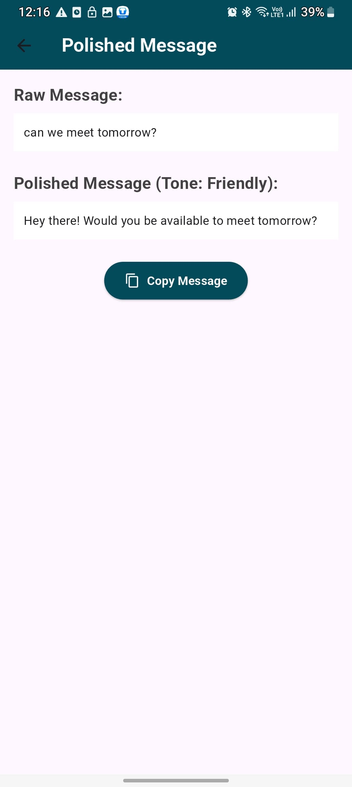

# ✨ AI Message Polisher

**AI Message Polisher** is a Flutter-based app that uses AI to polish and refine your messages. Whether you're writing emails, formal texts, or casual notes, this app helps make your messages more professional, polite, or impactful using the power of Google Gemini (or OpenAI).

---

## 📱 Screenshots











---

## 🚀 Features

- 🧠 Smart AI-generated message polishing  
- ✍️ Instant text improvement with natural language understanding  
- 🔁 Polished result preview  
- 📋 Copy or share improved messages  
- 🌙 Clean and user-friendly Flutter UI  

---

## 🔧 Technologies Used

- Flutter 3.x  
- OpenAI API  
- Dart  
- Material UI  
- HTTP Package  

---

## 🔐 API Key Setup

This project uses an AI API (OpenAI). For security reasons, the real API key is **not included** in this repository.

### ✅ Steps to Set Up:

1. Create a file at `lib/secrets.dart`:

```dart
class Secrets {
  static const String openAiApiKey = "your_real_api_key_here";
}
